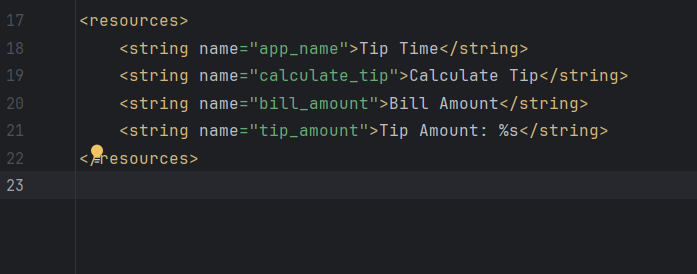
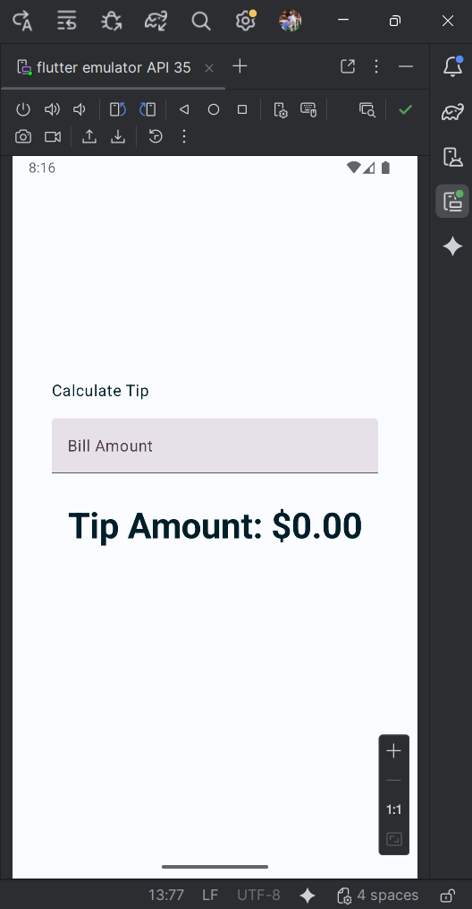
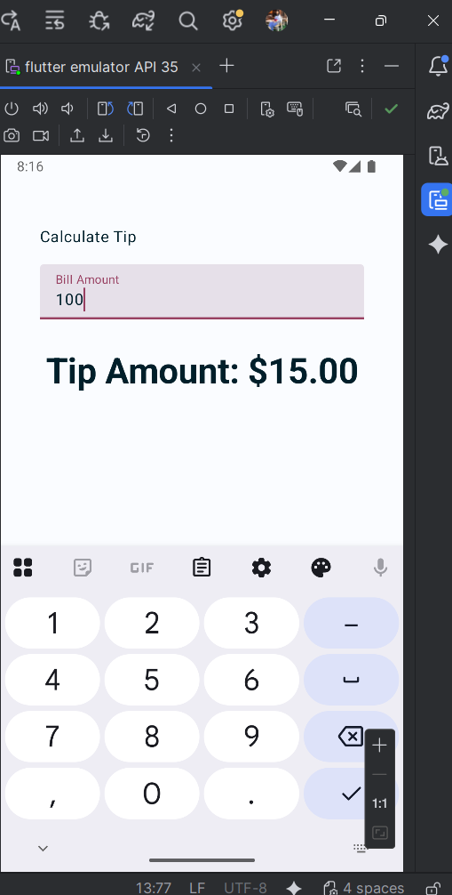

# 💸 Tip Time — Tip Calculator (Android Kotlin + Jetpack Compose)

> **Module :** Développement Mobile Android  
> **Étudiante :** Balkiss Doulemi  
> **Classe :** IAM  
> **Date :** 22-02-2026  

---

## 🎯 Présentation du projet

**Tip Time** est une application Android permettant à l’utilisateur de :

- saisir le **montant d’une facture**
- calculer automatiquement un **pourboire (15%)**
- afficher le résultat au **format monétaire**

L’application est développée en **Kotlin** avec **Jetpack Compose**.

➡️ L’interface est **déclarative** :  
l’UI dépend de l’état, et toute modification déclenche automatiquement une **recomposition**.

---

## 🧩 Fichier important — `strings.xml`

Le fichier `res/values/strings.xml` contient les chaînes utilisées dans l’application.  
Bonne pratique : éviter le texte en dur dans le code.

### 📸 Capture — Fichier `strings.xml`

<p align="center">
  
</p>

### 💻 Code du fichier

```xml
<resources>
    <string name="app_name">Tip Time</string>
    <string name="calculate_tip">Calculate Tip</string>
    <string name="bill_amount">Bill Amount</string>
    <string name="tip_amount">Tip Amount: %s</string>
</resources>
```

🔎 Le `%s` dans `tip_amount` permet d’afficher une valeur dynamique (le pourboire calculé).

---

# 🧱 Étape 1 — Starter UI

Au départ, `TipTimeLayout()` affiche :

- un texte **Calculate Tip**
- un texte **Tip Amount: $0.00**
- un `Spacer`
- le tout organisé dans une `Column`

```kotlin
@Composable
fun TipTimeLayout() {
    Column(
        modifier = Modifier.padding(40.dp),
        horizontalAlignment = Alignment.CenterHorizontally,
        verticalArrangement = Arrangement.Center
    ) {
        Text(text = stringResource(R.string.calculate_tip))

        Spacer(modifier = Modifier.height(16.dp))

        Text(text = stringResource(R.string.tip_amount, "$0.00"))
    }
}
```

---

# ⌨️ Étape 2 — Ajout du champ de saisie

```kotlin
@Composable
fun EditNumberField(modifier: Modifier = Modifier) {
    TextField(
        value = "",
        onValueChange = {},
        modifier = modifier
    )
}
```

---

# 🔁 Étape 3 — Gestion de l’état

```kotlin
var amountInput by remember { mutableStateOf("") }
```

Cette ligne permet :

- de mémoriser la valeur saisie
- de déclencher la recomposition automatique

---

# ✨ Étape 4 — Amélioration UX

```kotlin
TextField(
    value = value,
    onValueChange = onValueChange,
    label = { Text(stringResource(R.string.bill_amount)) },
    singleLine = true,
    keyboardOptions = KeyboardOptions(
        keyboardType = KeyboardType.Number
    ),
    modifier = modifier
)
```

Améliorations :

- Label "Bill Amount"
- Clavier numérique
- Champ sur une seule ligne

---
<p align="center">
  
</p>

# 🧮 Étape 5 — Calcul du pourboire

```kotlin
private fun calculateTip(
    amount: Double,
    tipPercent: Double = 15.0
): String {
    val tip = tipPercent / 100 * amount
    return NumberFormat.getCurrencyInstance().format(tip)
}
```

Conversion sécurisée :

```kotlin
val amount = amountInput.toDoubleOrNull() ?: 0.0
```
<p align="center">

</p>

---

# ⬆️ Étape 6 — State Hoisting

`EditNumberField()` devient stateless :

```kotlin
@Composable
fun EditNumberField(
    value: String,
    onValueChange: (String) -> Unit,
    modifier: Modifier = Modifier
)
```

`TipTimeLayout()` gère l’état et l’affichage dynamique.

---

# 🎯 Résultat Final

✔ Gestion d’état avec `remember`  
✔ Recomposition automatique  
✔ State Hoisting  
✔ Conversion sécurisée  
✔ Format monétaire  
✔ UX améliorée  

---

🚀 Projet réalisé avec **Jetpack Compose**
